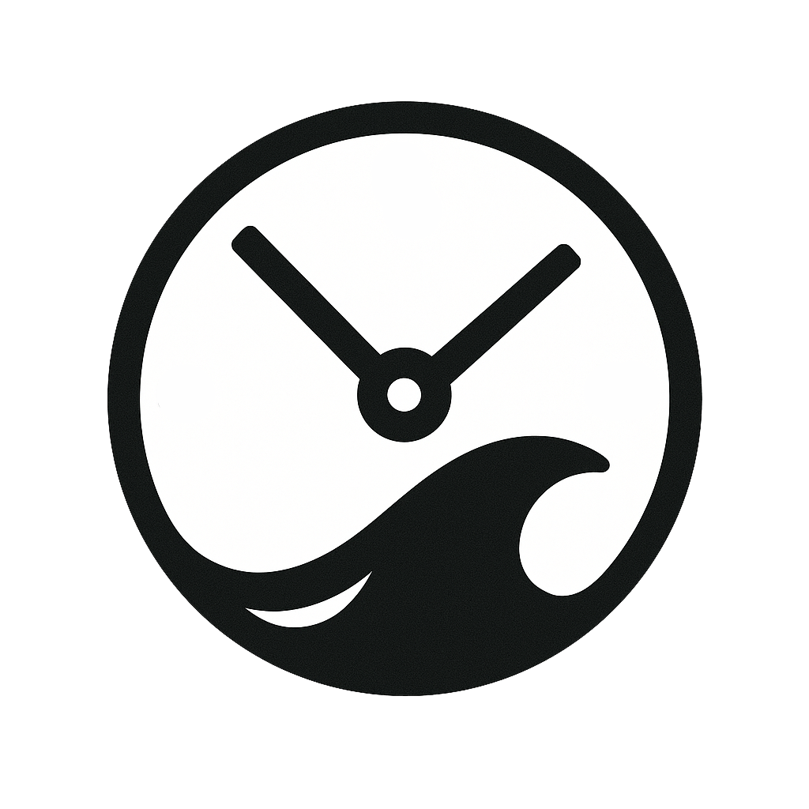
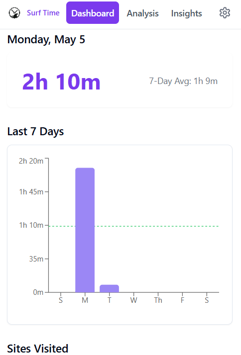
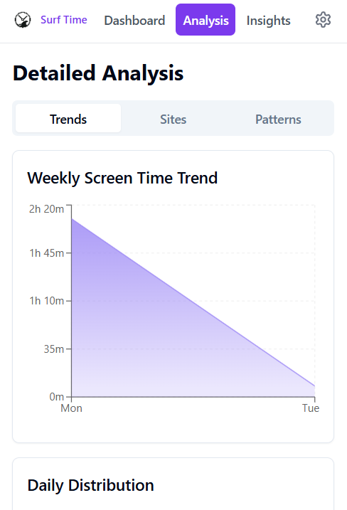
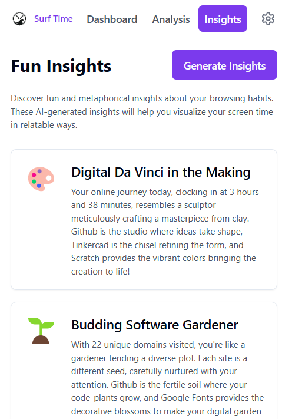
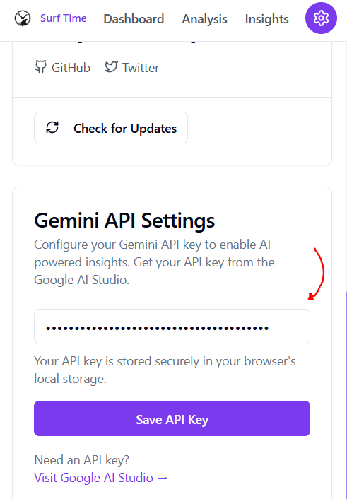

<p align="left">
  
</p>

# Surf Time - Your Digital Time Tracker
Surf Time is your personal screentime extension, keeping an eye on your browsing habits and helping you stay on top of your online time. Whether you're diving deep into work or just catching some casual waves on the internet, Surf Time's got your back!

### 🌟 Key Features

- **📊 Real-Time Wave Tracking**
  - Beautiful, interactive charts showing your daily surf patterns
  - Weekly insights into your browsing habits
  - Track time spent on different websites like waves on your favorite beach

- **🧠 Fun Insights**
  - AI-powered analysis of your browsing patterns
  - Personalized tips for better digital wellness
  - Weekly surf reports of your online activity

- **🔒 Privacy First**
  - All data stays local on your device
  - No tracking, no data collection
  - You're the only one who sees your waves

## 🚀 Quick Start

1. **Install the Extension**
   ```bash
   # Clone the repo
   git clone https://github.com/yourusername/surf-time.git
   cd surf-time

   # Install dependencies
   npm install

   # Build the extension
   npm run build
   ```

2. **Load in Chrome**
   - Open Chrome and go to `chrome://extensions/`
   - Enable "Developer mode"
   - Click "Load unpacked"
   - Select the `dist` folder

3. **Start Surfing! 🏄‍♂️**
   - Click the Surf Time icon in your browser
   - Watch your waves roll in as you browse
   - Check your stats anytime

## 🎨 Features in Action

<table>
  <tr>
    <td align="center">
      
      <br />
      <em>Dashboard View</em>
    </td>
    <td align="center">
      
      <br />
      <em>Analysis View</em>
    </td>
  </tr>
  <tr>
    <td align="center">
      
      <br />
      <em>Insights View</em>
    </td>
    <td align="center">
      
      <br />
      <em>Settings View</em>
    </td>
  </tr>
</table>

## 🛠️ Tech Stack

- **Frontend**: React + TypeScript
- **State Management**: React Context
- **Styling**: Tailwind CSS
- **Charts**: Recharts
- **AI**: Google Gemini API
- **Build**: Vite + Chrome Extension Manifest V3

## 🤝 Contributing

Wanna help make these waves bigger? Awesome! Check out our [Contributing Guide](CONTRIBUTING.md) to get started.

1. Fork the repo
2. Create your feature branch (`git checkout -b feature/AmazingFeature`)
3. Commit your changes (`git commit -m 'Add some AmazingFeature'`)
4. Push to the branch (`git push origin feature/AmazingFeature`)
5. Open a Pull Request

## 📝 License

Distributed under the MIT License. See `LICENSE` for more information.

<p align="center">Made it to school my friend on his screentime</p>